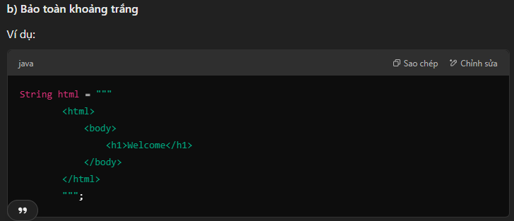
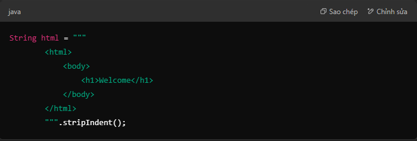
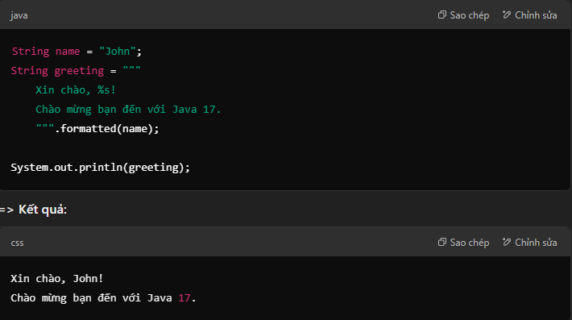

1. Cú pháp khai báo Text Block trong Java 17.

`String textBlock = """
    Đây là một chuỗi nhiều dòng
    trong Java 17 sử dụng Text Block.
    Nó hỗ trợ ký tự đặc biệt mà không cần escape!
""";`

- Điểm khác biệt so với chuỗi truyền thống ("")
- Không cần dùng \n: Xuống dòng tự động.
- Dễ đọc và bảo trì hơn.
- Hỗ trợ ký tự đặc biệt dễ dàng hơn

***Khoảng trắng được giữ nguyên, giúp code dễ nhìn hơn.***

***Hỗ trợ stripIndent() để xóa khoảng trắng thừa. Giúp nội dung dễ đọc hơn.***

***d) Hỗ trợ formatted() để chèn giá trị động. sử dụng .formatted() để format chuỗi Text Block:***

- Kết luận: Text Block trong Java 17 giúp làm việc với chuỗi nhiều dòng dễ dàng hơn, giảm bớt ký tự escape và cải thiện độ rõ ràng của code. Nó rất hữu ích khi làm việc với JSON, HTML, SQL, XML, Markdown,
