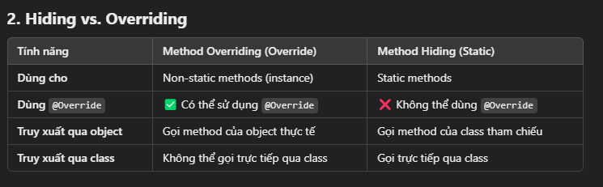
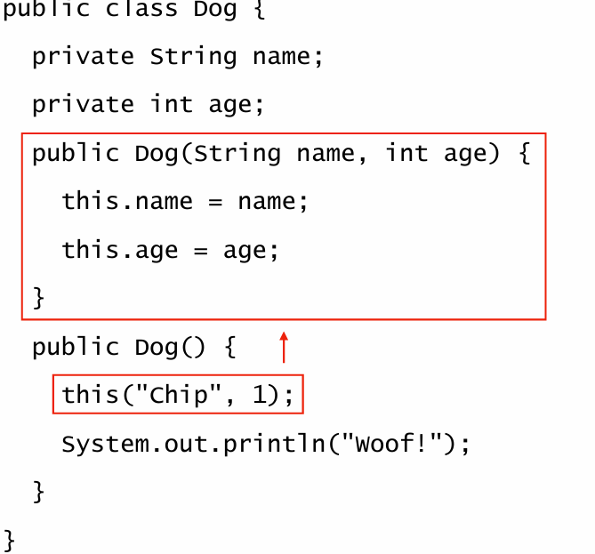
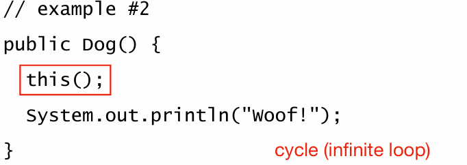
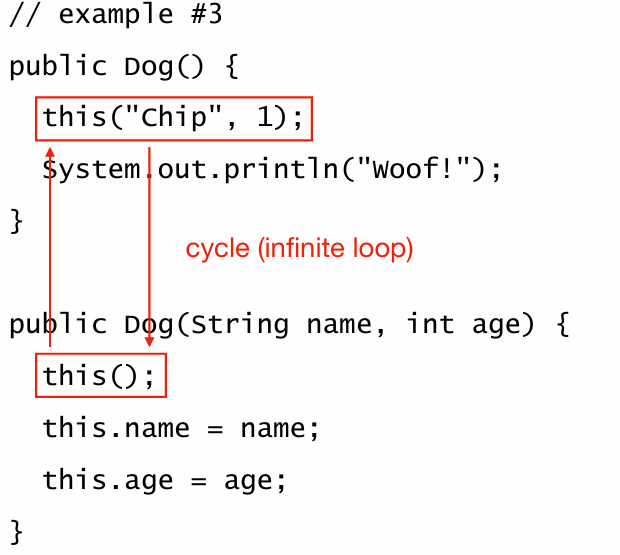
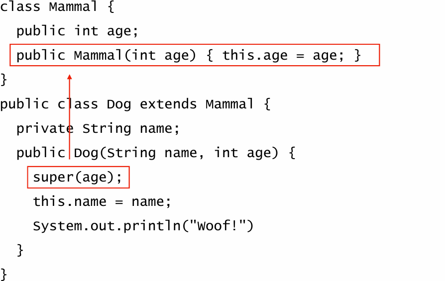
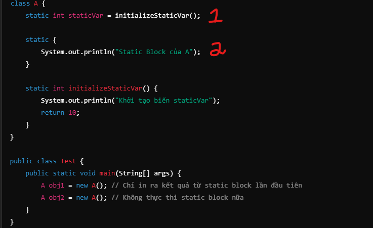
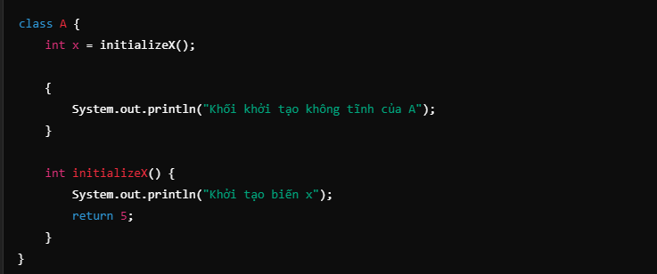
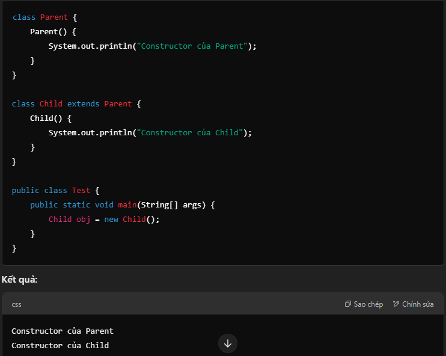

1. **Kế thừa (Inheritance)**.

`public class Animal { }`

`public class Dog extends Animal { }`
- Class Dog kế thừa từ class Animal. Class Dog được gọi là subclass, class Animal được gọi là superclass.
- Subclass kế thừa tất cả các fields và methods từ superclass.
2. **Kế thừa chuyển tiếp (Inheritance is transitive)**.

`public class Animal { }`

`public class Mammal extends Animal { }`

`public class Dog extends Mammal { }`
- Class Dog kế thừa từ class Mammal và class Mammal kế thừa từ class Animal. Nhưng class Dog chỉ thông qua class Mammal để kế thừa từ class Animal.
- Java hỗ trợ kế thừa duy nhất. Class chỉ có thể có một super class trực tiếp.
- nhưng class có thể triển khai nhiều interface.
3. **Phạm vi truy cập Class (Class modifiers)**
- **public**: class có thể được truy cập từ bất kỳ đâu.
- **(default) (Package-private)**: class chỉ có thể được truy cập từ cùng một package.

`public class PublicClass { }`// Có thể truy cập từ bất kỳ đâu

`class DefaultClass { }`// Chỉ có thể truy cập trong cùng package

- **final**: class không thể được kế thừa.

`final class FinalClass {}` // Lớp này không thể bị kế thừa
`class SubClass extends FinalClass { }` // ❌ Lỗi: Không thể kế thừa class final

- **abstract**: Class trừu tượng (có thể có phương thức trừu tượng).

`abstract class AbstractClass {
    abstract void show(); 
}` // Phương thức trừu tượng (không có phần thân)

`class ConcreteClass extends AbstractClass {
    void show() {
        System.out.println("Triển khai phương thức abstract.");
    }
}`

- **static**: Lớp lồng nhau (nested class) có thể tồn tại độc lập với instance của outer class.

`class OuterClass {
    static class StaticNestedClass {
        void display() {
            System.out.println("Đây là lớp lồng nhau static.");
        }
    }
}
`

- **protected**: là một access modifier có thể được sử dụng cho biến (fields), phương thức (methods), và constructors, 
nhưng không thể áp dụng cho lớp (class) cấp cao nhất.
- Có thể được truy cập từ: Cùng một class, Các class trong cùng package, Các class con (subclass), ngay cả khi ở package khác (thông qua kế thừa)

- **sealed (Java 17)**: Hạn chế các lớp con có thể kế thừa.

`sealed class SealedClass permits Child1, Child2 {}` // Chỉ cho phép kế thừa bởi Child1, Child2

- **non-sealed (Java 17)**: Cho phép kế thừa nhưng không bị ràng buộc bởi sealed.

`final class Child1 extends SealedClass {}` // Được phép kế thừa

`non-sealed class Child2 extends SealedClass {}` // Không bị giới hạn thêm`

4. **Object class**

- tất cả các class Java đều ngầm kế thừa từ class java.lang.Object
- Object là class duy nhất không có lớp super class
- mọi class đều có quyền truy cập vào các method được xác định trong lớp Object: toString(), equals(), hashCode()

5. **Constructor**
- Constructor là một phương thức đặc biệt không có kiểu trả về, được sử dụng để khởi tạo đối tượng.
- Constructor có tên giống với tên class.
- Constructor không có giá trị trả về.
- Constructor overloading. 
- Trong trường hợp này, thực thể thường được tạo thông qua một số phương thức tĩnh và không sử dụng từ khóa new. create Dates and Times, e.g.
  
`LocalDate now = LocalDate.now()`

`public class Dog { 
  public Dog() { System.out.println("Woof!"); } 
}`

6. **Kế thừa phương thức(Inheriting Methods)**
- Subclass kế thừa tất cả các phương thức từ superclass.
- Subclass có thể ghi đè một phương thức kế thừa từ superclass.
- khai báo một triển khai mới cho một phương thức kế thừa
- with same signature (name & parameters) và kiểu trả về đồng biến
- Tính chất của đối tượng có nhiều dạng khác nhau được gọi là đa hình (polymorphism).

`class Mammal { 
  public void speak() { 
    System.out.println("Mammal is making a sound."); 
  } 
}`

`public class Dog extends Mammal { 
  @Override 
  public void speak() { 
    System.out.println("Woof!"); 
    super.speak(); 
  } 
  public static void main(String[] args) { 
    Dog dog = new Dog(); 
    dog.speak(); 
  } 
}`

7. **Method Overriding Rules**
- Phương thức ghi đè phải có cùng tên, cùng tham số và cùng kiểu trả về.
- Phương thức ghi đè ít nhất phải có thể truy cập được như phương thức ban đầu
- Loại trả về của phương thức ghi đè phải giống nhau hoặc kiểu con của kiểu trả về của phương thức ban đầu (kiểu trả về đồng biến)

- 1️⃣ Có thể thay đổi phạm vi truy cập theo hướng mở rộng (protected → public ✅).
- 2️⃣ Không thể thêm ngoại lệ checked mới nếu phương thức cha không khai báo.
- 3️⃣ Có thể thay đổi ngoại lệ nếu đó là cùng cấp hoặc subclass của ngoại lệ gốc. FileNotFoundException is subclass IOException ✅.
- 4️⃣ Không thể khai báo ngoại lệ checked lớn hơn ngoại lệ trong phương thức gốc. FileNotFoundException  nếu phương thức gốc khai báo IOException ❌.

8. **Ghi đè các phương thức riêng tư và tĩnh** (Overriding private and static methods)

***Method private***
- Nếu method là private, nó sẽ không hiển thị với các class khác. Chỉ gọi qua class chính nó
- Nếu Phương thức có cùng signature là lớp con độc lập với phương thức đó. Đây không phải là ghi đè, nó chỉ là method hoàn toàn khác

***Method static***
- Nếu phương thức là static, phương thức "Overriding" cũng phải được khai báo static.
- Nếu phương thức không phải là static, nó sẽ được gọi là method hiding, không phải là ghi đè.
- Các phương thức được đánh dấu là **final** không thể ghi đè hoặc ẩn

- variables cannot be overriden, only hidden

9. **Method this()**

- Phương thức đặc biệt this() được sử dụng để gọi một constructor khác trong constructor, trong cùng một class.

***Rules for using this()***
- this() chỉ có thể được gọi trong line đầu tiên trong constructor
- this() chỉ có thể được gọi một lần
- Bạn phải cẩn thận để không tạo ra một "chu kỳ" vô hạn của các constructor gọi nhau

10. **Method super()**
- Phương thức đặc biệt super() được sử dụng để gọi một constructor của một **superclass** trong một constructor của **subclass**
- Nếu không có this() hoặc super() trong dòng đầu tiên, thì trình biên dịch sẽ tự động chèn super()

***Rules for using super()***
- Nếu không có this() hoặc super() rõ ràng trong dòng đầu tiên của hàm khởi tạo, trình biên dịch sẽ chèn super() vào đầu mỗi hàm khởi tạo
- Chỉ có thể gọi một lần
- Phải được gọi trong dòng đầu tiên của constructor
- Trường hợp: superclass có tạo constructor có đối số, thì hàm super() subclass extends phải có đối số giống superclass 

11. **Initialize Object
- Một đối tượng được khởi tạo thông qua constructor.
- Nếu có một superclass, nó sẽ được khởi tạo trước
- Tất cả các biến tĩnh được xử lý (theo thứ tự xuất hiện)
- Tất cả các trình khởi tạo tĩnh được xử lý (theo thứ tự xuất hiện)

- Static variables được khởi tạo theo thứ tự chúng xuất hiện. 
- Static blocks được thực thi theo thứ tự xuất hiện từ trên xuống

- Instance variables được khởi tạo trước instance initializer blocks.
- Instance blocks được thực thi trước constructor.

- Nếu lớp hiện tại kế thừa một lớp cha (superclass), thì constructor của lớp cha sẽ được gọi trước constructor của lớp con.

- 📌 Tóm tắt thứ tự khởi tạo
- Khi tạo một thực thể (new Object()), JVM thực hiện theo thứ tự sau:

- 1️⃣ Nạp lớp (class loading) (chỉ một lần)
- 2️⃣ Khởi tạo biến static và thực thi static block (chỉ một lần). Thực thi supper class trước, sau đó thực thi subclass.
- 2️⃣ Thực thi câu lệnh trong main() trước khi tạo object
- 3️⃣ Cấp phát bộ nhớ cho object
- 4️⃣ Khởi tạo biến instance và thực thi instance initializer blocks. Thực thi supper class trước, sau đó thực thi subclass.
- 5️⃣ Gọi constructor của lớp cha (super())
- 6️⃣ Thực thi constructor của lớp con
